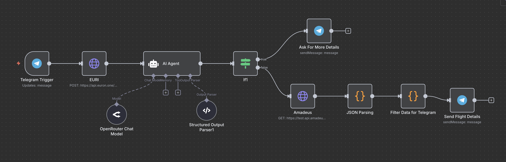

# ✈️ AI-Powered Flight Search Telegram Bot

This project is a fully automated **Telegram bot** that uses **AI** and the **Amadeus Flight Offers Search API** to help users search for flights using natural language. It’s built using **n8n** for workflow orchestration, **OpenAI GPT models** for input understanding, and **JavaScript nodes** for data formatting and transformation.

---

## 📦 Features

- ✅ Understands natural language flight search queries
- ✅ Uses AI to extract structured flight search parameters
- ✅ Supports flexible input like "Flights from Delhi to Dubai next Friday for 2 people"
- ✅ Returns real-time flight data from the **Amadeus API**
- ✅ Telegram integration for conversational interface
- ✅ Built on **n8n** – no-code/low-code automation
- ✅ Uses GPT-4.1-nano and GPT-OSS-120B for parsing and extraction

---

## Workflow 



--- 

## 📲 Try the Bot on Telegram

You can chat with the bot here:

👉 [Open Telegram Bot](https://t.me/tanish_flight_bot)

--- 

## ⚙️ How It Works

1. **User sends a message** to the Telegram bot.
2. **n8n webhook** receives the message.
3. The input is sent to **GPT-4.1-nano** to classify whether it's a flight search or not.
4. If it's a flight query, the message is passed to **GPT-OSS-120B** with structured output prompts to extract:
   - Origin and Destination (IATA or city names)
   - Departure date (supports natural language like "tomorrow")
   - Number of passengers
5. If any required detail is missing, a friendly message is returned to the user asking for more info.
6. If all required fields are available:
   - The data is converted into a **valid Amadeus API request format**
   - A live flight search is performed via **HTTP Request Node**
   - The raw response is parsed and formatted using **JavaScript Code Nodes**
7. The flight options are sent back to the user via Telegram.

---

## 🧠 AI Models Used

| Task | Model |
|------|-------|
| Classify input as flight search | GPT-4.1-nano |
| Extract structured flight info | GPT-OSS-120B |

---

## 🧾 Amadeus API

- **Endpoint**: [Flight Offers Search](https://developers.amadeus.com/self-service/category/air/api-doc/flight-offers-search)
- **Required Fields**:
  - `originLocationCode` (IATA)
  - `destinationLocationCode` (IATA)
  - `departureDate` (YYYY-MM-DD)
  - `adults` (default: 1)

---

## 🔐 Environment Variables

Create a `.env` file (or use n8n's credential system) with the following:

- TELEGRAM_BOT_TOKEN=your_telegram_bot_token
- AMADEUS_CLIENT_ID=your_amadeus_api_key
- AMADEUS_CLIENT_SECRET=your_amadeus_api_secret

---

## 🚀 Getting Started

### 1. Clone the Repo

```bash
git clone https://github.com/tanishra/Flight-Search-Bot.git
cd Flight-Search-Bot
```

### 2. Import Workflow into n8n
- Open your n8n instance
- Go to Workflows > Import
- Upload n8n/Flight Search Bot.json

### 3. Set Up Telegram Bot
- Create a bot with @BotFather
- Get the bot token and add it to your .env
- Set webhook to your n8n webhook URL
```bash
curl -X POST "https://api.telegram.org/bot<YOUR_BOT_TOKEN>/setWebhook?url=https://your-n8n-domain/webhook/telegram"
```

### 4. Get Amadeus API Credentials
- Register at [Amadeus for Developers](https://developers.amadeus.com)
- Create an application to get client_id and client_secret

---

## 📘 Prompt Engineering
See the prompts/ folder for GPT prompt templates:
- **classify-query.md:** Checks if message is about flight search
- **extract-flight-info.md:** Extracts all required details in JSON for Amadeus API

---


## 🧰 JavaScript Nodes in Workflow

These are the custom JavaScript code nodes used within the n8n workflow:

### ✅ `json-parser.js`

- Parses the raw response received from the Amadeus API
- Filters unnecessary data
- Converts the response into structured and usable JSON for further processing

### ✅ `format-telegram.js`

- Takes the parsed flight data and formats it into a human-friendly message
- Prepares the final message layout for Telegram users
- Adds emojis, formatting, and key flight information (e.g., airline, price, departure/arrival times)

---

## 🛠 Future Enhancements

Some ideas and improvements planned for upcoming versions:

- 🔄 **Multi-turn conversation support**  
  Allow the bot to remember previous messages for follow-up inputs like “yes”, “change date”, etc.

- 🧳 **Baggage and seat preferences**  
  Let users specify if they want extra baggage, window seats, etc.

- 🌍 **Multi-language support**  
  Support queries in other languages, especially Hindi, Spanish, etc.

- 💾 **Query logging and session tracking**  
  Log user queries for analytics, debugging, or improving AI model accuracy

---

## 🤝 Contribution

Got an idea or found a bug? Fork the repo, make your changes, and open a pull request!

All contributions — big or small — are welcome. 🙌

---


